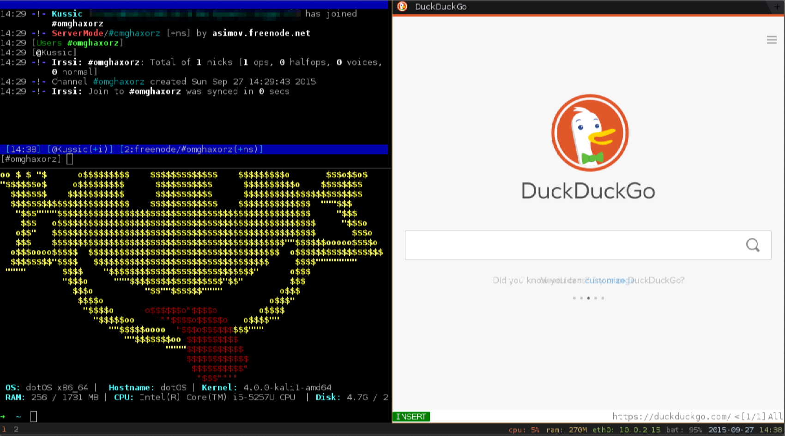

# dotOS - Kali 2 like a real boy
dotOS is a custom Kali 2 installation geared towards hackers who feel more comfortable with a keyboard and don't appreciate the delays introduced by using a mouse all the time.   
Build with Kali 2, i3wm, fish shell, ptf, vimperator (firefox), conky and a few extra things here and there that make [my](https://twitter.com/kussic) hacking more streamlined.



>Step by step instructions below. Your milleage may vary since things do change every now and again. If some instruction doesn't work fix it and then let me know. _I'm not your customer support  desk!_

0. Skip step (2) below and download the iso   
    Go to the [i3wm-kali-rolling release] (https://github.com/kussic/dotOS/releases/tag/i3wm-kali-rolling) and download the iso.

1. OR Build your custom Kali 2 i3wm iso   
    From an existing Kali installation run the following commands:
	```
	apt-get update
	apt-get install curl git live-build cdebootstrap
	git clone git://git.kali.org/live-build-config.git
	cd live-build-config
	```
	At this point you can customise the contents of the distribution, by default it's the full Kali install with everything included.
	If you're okay with this skip the next step and go straight to the __"./build.sh [...]"__ command below.
	I personally hate bloat so I tweak __"kali-config/variant-i3wm/package-lists/kali.list.chroot"__ to only install the Top 10 by default:
	```
	# You always want those
	kali-linux
	kali-desktop-live

	# Kali applications

	# You can customize the set of Kali applications to install
	# (-full is the default, -all is absolutely everything, the rest
	# corresponds to various subsets)
	# kali-linux-full
	# kali-linux-all
	# kali-linux-sdr
	# kali-linux-gpu
	# kali-linux-wireless
	# kali-linux-web
	# kali-linux-forensic
	# kali-linux-voip
	# kali-linux-pwtools
	kali-linux-top10
	# kali-linux-rfid

	# Graphical desktop
	kali-desktop-common
	xorg
	dmenu
	conky
	i3
	```
	I deal with everything else during post installation. This makes a leaner disk and a smaller install size and time.

			
	Run the build script:
	`./build.sh --distribution kali-rolling --variant i3wm --verbose`

	>NOTE: this will take its sweet time, at the end you will have an .iso file if everything went right!

2. Install Kali 2   
   Just follow the normal steps to install Kali in your VM and install the right vmtools.

   Virtualisation | Command
   ---------------|---------
   VirtualBox     | apt-get install virtualbox-guest-utils
   VMware         | _Use the vmware tools that come with Player/Workstation_

3. Add Penetration Testing Framework     
   Install, run it and just add the tools you like, as needed…
   ```
   cd /opt/
   git clone https://github.com/trustedsec/ptf.git
   cd ptf
   ./ptf
   ```	
		
		
4. (Optional) Add extra tools
	``` 
	#Add i386 architecture support and wine32
	dpkg --add-architecture i386 && apt-get update && apt-get install wine32

	#Install some most needed extra tools
	apt-get install arp-scan passing-the-hash netdiscover mono-runtime proxychains tshark python-openssl wmis hashid python-pyside mitmproxy netwox python-pip dh-autoreconf
	
	#Use PTF to install a bunch of useful tools
	* modules/exploitation/responder
	* xfreerdp (custom)
	* modules/intelligence-gathering/eyewitness
	* modules/vulnerability-analysis/sslyze
	* modules/vulnerability-analysis/ike-scan
	* modules/exploitation/impacket
	* nfsshell (custom)
	
	#Install the awesome curses WICD network manager
	apt-get install wicd-curses


	#Get your local clone
	cd ~ && git clone https://github.com/kussic/dotOS.git
	```

5. Install [Fish Shell] (http://fishshell.com) 
	```
	apt-get install bc
    	Download the latest "Debian 8" package from: https://software.opensuse.org/download.html?project=shells%3Afish%3Arelease%3A2&package=fish
	dpkg -i <whateverthepackagewascalled.deb>
	chsh -s /usr/bin/fish
	```
	_Optional: append the "DO NOT PANIC" logo to ~/.config/fish/config.fish_
	```
	mv ~/dotOS/dotfiles/dotos-bin ~/.dotos-bin
	fish
	echo "~/.dotos-bin/obey2" >> ~/.config/fish/config.fish
	```

6. Install the custom i3wm dotfiles
	```
	mv ~/.i3 ~/.i3-bak
	mv ~/dotOS/dotfiles/i3 ~/.i3
	```

7. Firefox with Vimperator (Optional but extra-leet-awesomesause)
	1. Download the right version of firefox from [here] (https://www.mozilla.org/en-US/firefox/all/) (look for, "Linux x64")
	2. Extract under `/opt/`
	3. Install vimperator plugin from within Firefox from [here] (https://addons.mozilla.org/en-US/firefox/addon/vimperator)
	4. Install Stylish plugin from within Firefox from [here] (https://addons.mozilla.org/en-US/firefox/addon/stylish)
	5. Apply the "~/dotOS/dotfiles/vimperator/firefox-css" to Stylish

8. Oracle Java
	1. Download the right version from http://java.com
	2. tar xzf <javafile>.tgz
	3. mv <javadir> /opt
	4. update-alternatives --install /usr/bin/java java /opt/<javadir>/bin/java 1
	5. update-alternatives --set java /opt/<javadir>/bin/java

##Credits
* Obey2 based on the idea of Archbey2 by Mr Green
* i3wm scripts based on the work of https://github.com/strang3quark
* Vimperator firefox CSS by http://twily.info/
